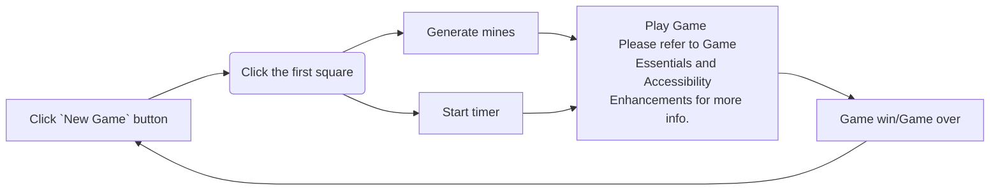
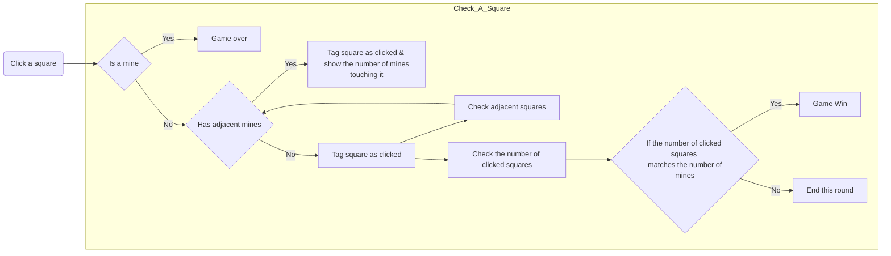
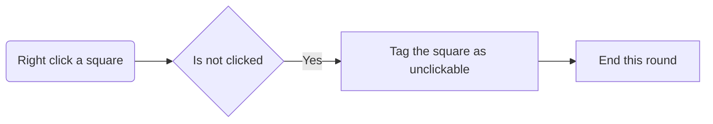
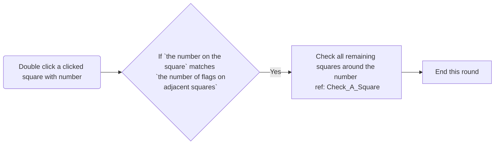

# Flow
## Overall
The mines should be set up after the first click since the first click can never be a mine. The timer, used to record the game duration, should be initialized at the beginning. When the user completes the game and clicks the new game button, the mines and timer will be reset.

## Game Essentials
### Clicking a square
Clicking on a square is a fundamental aspect of the game. It allows us to determine whether the user has clicked on a mine, display the count of adjacent mines, and check if the user has successfully located all the mines

## Accessibility Enhancements
Accessibility features include flagging and chording. Users can flag unclicked squares, indicating the presence of a mine beneath. If a user double-clicks a previously clicked square with a number, we check the number of flags on adjacent squares. If the number of flags matches the number on the clicked square, we check all remaining squares around that number.

### Flagging

### Chording

